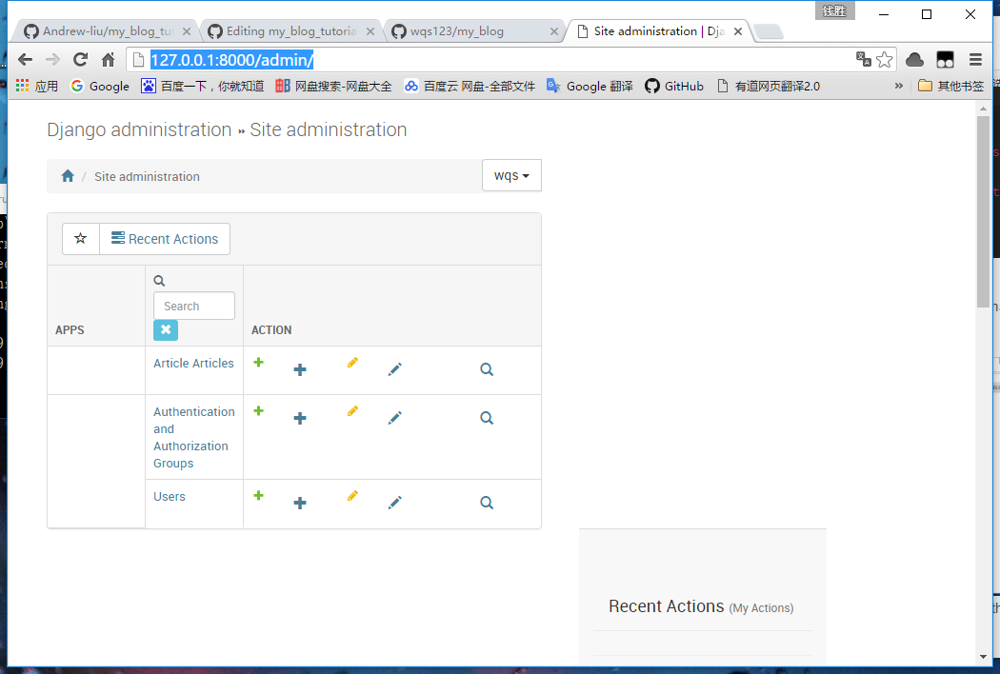

# Environment
- Python3.X
- Django1.9.X
- Sublime Text 3

#Usage

You can use the example by doing step by step below:

```
$ git clone https://github.com/wqs123/my_blog.git
$ cd my_blog
$ pip install -r requirement.txt
$ python manage.py runserver
```
Then you will  see 
```
Performing system checks...

System check identified no issues (0 silenced).
March 18, 2016 - 19:40:42
Django version 1.9, using settings 'my_blog.settings'
Starting development server at http://127.0.0.1:8000/
Quit the server with CTRL-BREAK.
```

Now open browser and input  :  http://127.0.0.1:8000/article/ ,you will see the main page like below:

and http://127.0.0.1:8000/admin/ you can see the admin page:



